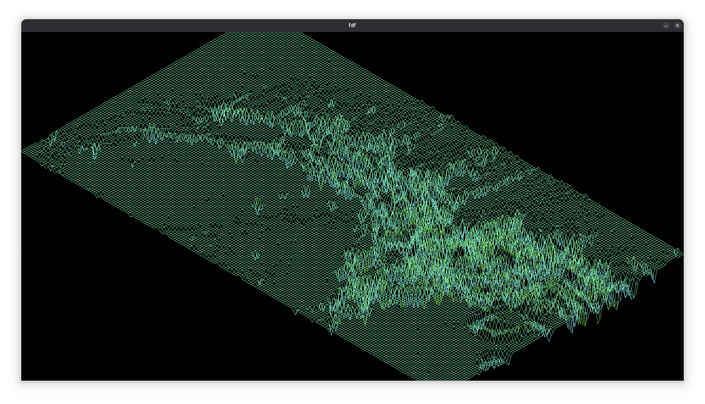

# FDF (Fil de Fer) - Wireframe Renderer

[MiniLibX]:[https://github.com/42paris/[MiniLibX]-linux]
[42school]:[https://github.com/42school]

<details>
<summary>Table of Contents</summary>

- [FDF (Fil de Fer) - Wireframe Renderer](#fdf-fil-de-fer---wireframe-renderer)
  - [Overview](#overview)
  - [Features](#features)
  - [Demo](#demo)
  - [Prerequisites](#prerequisites)
  - [Installation](#installation)
  - [Usage](#usage)
  - [Controls](#controls)
  - [Notes](#notes)
  - [Acknowledgments](#acknowledgments)

</details>

## Overview

FDF (Fil de Fer, or "Wireframe") is a graphical project developed in C as part of the [42 school][42school] curriculum. This program visualizes 3D wireframe models from 2D coordinate maps using the [MiniLibX] library. It reads a `.fdf` file containing X, Y, and Z coordinates, where Z represents height, and renders an isometric or orthograpgic projection of the terrain as a wireframe mesh. The project focuses on graphics programming, matrix transformations, and event-driven programming.

## Features

- **Wireframe Rendering**: Displays 3D terrain as a wireframe mesh by connecting points with lines.
- **Projections**: Supports isometric and orthographic projections.
- **Interactive Controls**: Allows rotation, zooming, and translation of the model via keyboard.
- **Color Mapping**: Maps colors to terrain heights for visual elevation cues (optional custom palette support).
- **Cross-Platform**: Compatible with macOS and Linux using [MiniLibX].
- **Smooth Window Management**: Handles window switching, minimizing, and closing cleanly.
- **Example Maps**: Includes sample `.fdf` map files to demonstrate functionality.

## Demo

<video src="media/Screencast.mp4" controls></video>





## Prerequisites

Before compiling and running the project, ensure you have the following:

- **Operating System**: macOS or Linux
- **Compiler**: GCC or Clang
- **MiniLibX**: The [MiniLibX] library for graphical rendering (you can initialize submodule included in repo)
- **Dependencies** (Linux):
  ```bash
  sudo apt-get update
  sudo apt-get install xorg libxext-dev zlib1g-dev libbsd-dev
  ```
- **Dependencies** (macOS):
  - XQuartz (optional, for [MiniLibX] on older macOS versions)
  - Ensure `gcc` or `clang` is installed via Xcode Command Line Tools

## Installation

1. **Clone the Repository**:
   ```bash
   git clone https://github.com/MikAghumyan/fdf.git
   cd fdf
   ```
2. **Initialize Submodules**:
   - The repository includes [MiniLibX] and few other projects as submodules. to initialize them run:
   ```bash
   git submodule update --init libft gnl mlx
   ```

3. **Set Up [MiniLibX]**:
   - If there are problems with [MiniLibX], follow platform-specific instructions:
     - **Linux**: Place [MiniLibX] for Linux (`mlx_linux`) in the `lib/` directory and run:
       ```bash
       chmod +x ./lib/mlx_linux/configure
       make -C ./lib/mlx_linux
       ```
     - **macOS**: Use the provided `mlx` folder or download [MiniLibX] for macOS.
   - [MiniLibX Setup Guide](https://harm-smits.github.io/42docs/libs/[MiniLibX])

4. **Compile the Project**:
   - The project includes a `Makefile` for compilation. Run:
     ```bash
     make
     ```
   - This compiles the program, linking with [MiniLibX] and any utility libraries (e.g., `libft` if included).

5. **Optional: Customize Window Size**:
   - Edit the `Makefile` to adjust window dimensions (e.g., `WINDOW_Y` and `WINDOW_X` for height and width). Example for Full HD:
     ```makefile
     CCFLAGS += -D WINDOW_Y=1080 -D WINDOW_X=1920
     ```

## Usage

1. **Run the Program**:
   - Execute the compiled binary with a `.fdf` map file as an argument:
     ```bash
     ./fdf test_maps/42.fdf
     ```
   - Replace `test_maps/42.fdf` with the path to your `.fdf` map file.

2. **Map File Format**:
   - The `.fdf` file contains a grid of numbers representing Z (height) values, with optional color codes (e.g., `0xFF0000` for red).
   - Example (`42.fdf`):
     ```
     0 0 0 0
     0 10 10 0
     0 10 10 0
     0 0 0 0
     ```

3. **Testing**:
  Use provided test maps in the `test_maps/` directory to explore different terrains.

## Controls

- **Exit Program**:
  - Press `ESC` or click the window’s close button to exit cleanly.
- **Projections**:
  - `1`: Switch to/Reset isometric projection.
  - `2`: Switch to orthographic top projection.
  - `3`: Switch to orthographic front projection.
  - `4`: Switch to orthographic side projection.
- **Transformations**:
  - **Rotate**:
    - use `A` and `D` to rotate along the Z axis
    - use `W` and `S` to rotate along the X axis
    - use `Q` and `E` to rotate along the Y axis
  - **Move**: Use arrow keys to translate the model.
  - **Zoom**: Use `-` and `+` to zoom in/out.
  - **Stretch**: Use `Z` and `X` to stretch up/down

## Notes

- **[MiniLibX]**: Ensure [MiniLibX] is properly configured for your platform to avoid rendering issues.
- **Memory Management**: The program is designed to be memory-leak-free, tested with `valgrind` (Linux).
- **ESC Key Ghosting**: On some systems, the ESC key may not work as expected. Comment out ESC-related code in the source and use `Ctrl+C` or the window close button instead.

## Acknowledgments

- **[42 School][42school]**: For providing the project framework and resources.
- **[MiniLibX]**: For the lightweight graphics library used in rendering.
- **Community**: Thanks to peers for providing assistance and sharing knowledge.
  [@42school](https://github.com/42school) [@42paris](https://github.com/42paris) [@RubBarkhudaryan](https://github.com/RubBarkhudaryan) [@Vruyr587](https://github.com/Vruyr587) [@Davhak2](https://github.com/Davhak2)